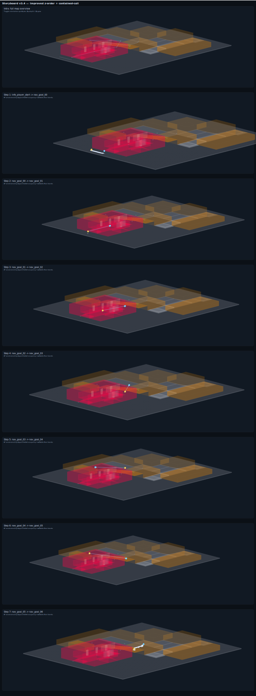

# Tile sampling, Spatialization, and Storyboard — Combined Overview

> Combined document presenting:
> 1. sample-grid-annotated.svg — tile sampling, layers, collision, PMove
> 2. spatialization-explainer.svg — cells, hashing, unordered_map, BSP leaves
> 3. storyboard.svg — large composite storyboard of maps/flows

<!-- PAGEBREAK -->
## 1 — Tile Sampling & Collision 

{ width=1280 }

Short summary:
- Top-down 4×4 sampling per 32×32 tile (coarse 8×8 cells).
- Multi-layer stacked samples for height-aware checks.
- PMove-style stepping example included.

<!-- PAGEBREAK -->
## 2 — Spatialization Explainer

{ width=1280 }

Key points:
- Spatial cells partition world for O(1)-ish neighbor queries.
- Hashing converts (cx,cy,cz) keys to unordered_map buckets (fast lookup).
- BSP leaves provide region-level locality for visibility and collision.
- Runtime chain: position → leaf → cell key → hash lookup → precise tests.

<!-- PAGEBREAK -->
## 3 — Navigation Isometric Perspective Example
{ width=1280 }