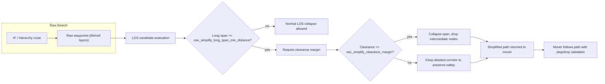

A very thorough explanation about the line-of-sight (LOS) simplification process in the A* pathfinding implementation, including how it evaluates candidate waypoints for LOS collapse, applies distance and clearance thresholds, and ensures safe navigation through narrow passages.

This diagram shows the actual synchronous traversal-query execution path in `src/baseq2rtxp/svgame/nav/svg_nav_traversal.cpp` for a monster or other caller once path generation enters `SVG_Nav_GenerateTraversalPathForOriginEx_WithAgentBBox()`. From there the flow proceeds through endpoint resolution, the direct-LOS shortcut attempt, coarse corridor building, fine `Nav_AStarSearch()`, and finally the post-A* waypoint simplification pass where `SVG_Nav_SimplifyPathPoints()` calls `Nav_LOS_HasClearanceMarginForLongSpan()`.

In other words: this is not a generic nav concept diagram. It documents the real code-path ordering used by the sync traversal query when a direct shortcut is not already enough to finish the request.
