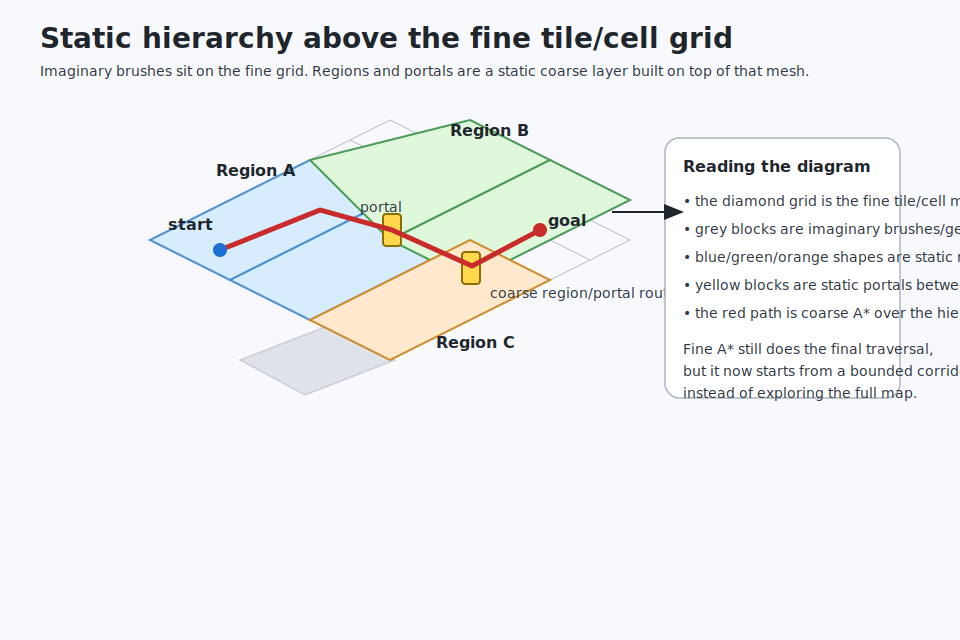
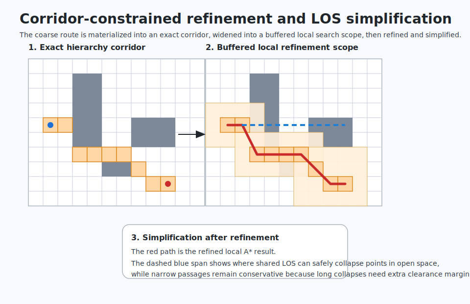
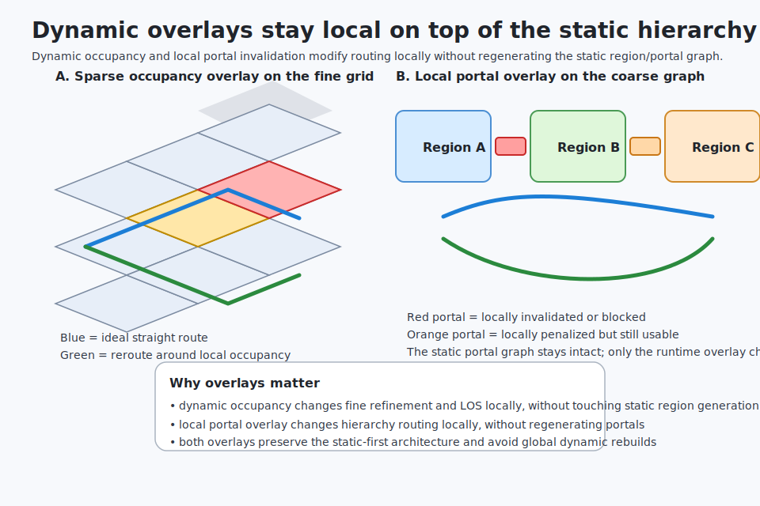

# Navigation Hierarchy Architecture

This document describes the final navigation architecture implemented under `src/baseq2rtxp/svgame/nav/`.

## Why flat pathfinding became too slow

The original long-range path flow depended on fine-grained A*  over canonical tile/cell/layer space for almost every expensive query. That approach remained correct, but open-area maps made it costly because:

- the neighbor expansion volume scaled with fine mesh density rather than route structure
- open lists and node tables grew large on long or open queries
- coarse tile clustering reduced some search space, but still behaved more like a hint than a true hierarchy
- dynamic behavior had to stay local, so large global rebuild approaches were not acceptable

The implemented architecture keeps the fine mesh authoritative, but stops using full-map fine A*  as the default long-range strategy.

## Final query flow

The implemented preferred query order is:

1. resolve canonical start/goal nodes
2. attempt direct LOS shortcut when the tuned LOS budget allows it
3. run coarse hierarchy routing over static regions/portals when the tuned hierarchy-preference gate allows it
4. materialize an explicit corridor from the coarse route
5. run local refinement inside that corridor
6. simplify the finalized path with shared LOS checks
7. fall back to cluster-guided or unrestricted fine search when needed

## Visual overview

### Static hierarchy over the fine grid

### Corridor-constrained refinement and simplification

### Dynamic overlays on top of static hierarchy

## Static-first hierarchy

The static hierarchy remains an internal implementation detail layered above the canonical fine mesh.

### Fine representation

The authoritative navigable world representation is still the sparse tile/cell/layer mesh:

- world tiles are canonical and keyed by world tile coordinates
- cells remain sparse inside tiles
- multiple layers per cell preserve stacked floors and vertical traversal structure
- layer and edge metadata still drive final traversal validation

### Coarse hierarchy

The hierarchy adds:

- static regions: deterministic groups of connected tiles
- static portals: traversable seams between neighboring regions
- coarse graph search: region/portal A*  for long-range routing

The hierarchy never replaces the fine mesh. It narrows the expensive search into a bounded local refinement problem.

## Direct LOS as an accelerator

The LOS system is a reusable accelerator, not a pathfinder replacement.

It is currently used for:

- direct start-to-goal shortcut attempts
- finalized-path simplification

The implemented simplification split is intentionally practical:

- sync simplification stays small and cheap:
  - duplicate removal
  - collinearity pruning
  - a tightly budgeted LOS collapse pass
- async simplification is allowed to be more aggressive with bounded farthest-jump LOS attempts
- async simplified output is swapped in only after immediate revalidation against current occupancy and clearance

Key safeguards:

- LOS remains policy-aware
- LOS consults sparse dynamic occupancy
- 3D LOS still relies on step-validating canonical traversal between sampled nodes
- long LOS collapses in narrow passages require additional clearance margin
- async simplification re-validates a candidate path immediately before commit/swap

### Why funnel is deferred for now

Funnel/string-pull is the right primary simplifier once the corridor stores true portal segment geometry.

The current portal representation stores a representative portal point, not a full segment or polygon aperture, so the current implementation intentionally stays on the LOS-based greedy simplification path for now. When richer portal geometry exists, funnel becomes the preferred primary corridor simplifier.

## Corridor-constrained refinement

After coarse hierarchy routing succeeds, the route is materialized into an explicit refinement corridor.

That corridor:

- preserves the exact hierarchy route shape
- widens into a buffered tile allow-list for fine A* 
- keeps long-range refinement local instead of global
- remains deterministic for benchmarking and comparison

The buffered corridor scope is now tunable at runtime through the near/mid/far widening thresholds and radii.

## Dynamic occupancy overlay

Dynamic occupancy stays overlay-based and local.

It is used to influence pathfinding without rebuilding the static hierarchy:

- hard blocked occupancy can reject traversal
- soft occupancy can bias refinement cost
- LOS treats occupancy as a shortcut veto when the overlay should influence the result

This keeps dynamic behavior responsive while avoiding global nav rebuild architecture.

## Local portal overlay

Static portals remain generated once from the static hierarchy.

Future-facing local dynamic behavior is handled by a runtime portal overlay that can:

- invalidate a portal locally
- hard-block a portal locally
- apply temporary local portal penalties

This lets dynamic inline-model handling evolve without requiring portal regeneration as the default strategy.

## Public API stability

Gameplay-facing callers still interact with navigation through simple origin/agent/policy-style APIs:

- sync traversal path generation from world-space origins
- async path requests through `SVG_Nav_RequestPathAsync()`
- per-entity follow state through `svg_nav_path_process_t`

Hierarchy, corridor, portal-overlay, and tuning details remain internal implementation details.

## Runtime tuning and benchmarking

The benchmark harness and structured query stats remain intentionally intact.

Important benchmark-visible concepts now include:

- direct LOS usage
- hierarchy preference and hierarchy fallback
- unrestricted refinement fallback
- exact corridor size
- buffered corridor radius and buffered corridor tile count
- simplification attempts and successes
- simplification waypoint reduction before/after
- duplicate and collinearity pruning counts
- simplification overhead milliseconds
- simplification fallback local-replan count
- occupancy overlay participation
- portal overlay participation

These diagnostics exist so open-area tuning can be compared without speculative rewrites.

## Intentional non-goals

The implementation intentionally does * * not** do the following:

- replace pathfinding with LOS-only routing
- introduce global dynamic nav rebuilds as the normal dynamic strategy
- regenerate the entire portal graph for local dynamic changes
- expose regions, portals, or corridor internals as required gameplay-facing concepts
- optimize purely for perfect path optimality at the expense of query speed
- implement a full perfect funnel/navmesh-only solution before the measured hierarchy path

## Limited cleanup policy

Only narrow cleanup is appropriate in the navigation code at this stage.

The following are intentionally preserved:

- benchmark hooks
- structured query stats
- fallback behavior
- internal tuning controls
- internal overlay hooks for future dynamic work

That preservation is deliberate: these systems are part of the migration safety net and measurement story.
