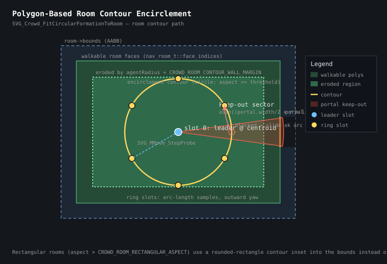

# Navigation System (NavMesh, Pathfinding & Locomotion)

A high-performance, deterministic 3D navigation and kinematic locomotion pipeline for ServerGame entities. Built around a double-precision half-edge navigation mesh, KD-Tree accelerated spatial queries, corridor-constrained Funnel string pulling with convex corner standoffs, and custom step-slide capsule physics.

---

## Table of Contents
1. [Architectural Overview](#1-architectural-overview)
2. [The BAAS Framework](#2-the-baas-framework)
3. [Bake: NavMesh Generation & Compilation](#3-bake-navmesh-generation--compilation)
4. [Activate: Agent Configuration & Spawning](#4-activate-agent-configuration--spawning)
5. [Assign: Target Assignment & Path Planning](#5-assign-target-assignment--path-planning)
6. [Simulate: Locomotion, Kinematics & Avoidance](#6-simulate-locomotion-kinematics--avoidance)
7. [Topological Spatial Decomposition & Zone Classification](#7-topological-spatial-decomposition--zone-classification)
8. [Tactical Cover Point System](#8-tactical-cover-point-system)
9. [Elaborative Interrogation (Deep-Dive Design Rationale)](#9-elaborative-interrogation-deep-dive-design-rationale)
10. [Integration Guide 1: Custom Entity (`svg_base_edict_t`)](#10-integration-guide-1-custom-entity-svg_base_edict_t)
11. [Integration Guide 2: Standard Monster (`svg_monster_base_t`)](#11-integration-guide-2-standard-monster-svg_monster_base_t)
12. [Level Design & Brush Authoring Guidelines](#12-level-design--brush-authoring-guidelines)
13. [CVars, Console Commands & Visual Diagnostics](#13-cvars-console-commands--visual-diagnostics)

---

## 1. Architectural Overview

The navigation system provides full-stack pathfinding and steering for AI agents:
* **Geometry Engine**: Extracts walkable brush windings directly from the BSP collision model (`cm_t`), performs CSG boolean clipping, dissolves sliver artifacts, and constructs a topological Half-Edge mesh.
* **Spatial Acceleration**: Combines a balanced 3D KD-Tree with a direct BSP Leaf Mapping table for instant $O(1)$ point-to-polygon localization.
* **Path Search**: Evaluates multi-criteria A\* over half-edge twins, handling stairs, step-ups, drops, dynamic door states, and custom cost callbacks.
* **Corridor Funneling**: Converts A\* face corridors into smooth, minimum-distance polylines via the Simple, Stupid Funnel Algorithm (SSFA) in double precision (`Vector3DP`).
* **Convex Corner Decoupling**: Analytically projects obstacle corner bisectors to insert standoff waypoints, guaranteeing physical capsule clearance around sharp geometry.
* **Kinematic Simulation**: Steers capsules using `SVG_MMove_StepSlideMove` (multi-plane sliding with predictive step-ups), completely bypassing legacy `SV_WalkMove`.

---

## 2. The BAAS Framework

The navigation lifecycle follows four modular stages:

```
┌─────────────────────────────────────────────────────────────────────────┐
│ 1. BAKE: Offline / Background Geometry Compilation                     │
│    BSP Brushes ──> Surface Normal Filter ──> CSG Subtraction ──>        │
│    Sliver Dissolution ──> Half-Edge Topology ──> KD-Tree ──> .nav7     │
└────────────────────────────────────────────────────┬────────────────────┘
                                                     │
┌────────────────────────────────────────────────────▼────────────────────┐
│ 2. ACTIVATE: Entity Bounds & Policy Definition                          │
│    SOLID_CAPSULE ──> nav_path_policy_t ──> mm_move_t Locomotion State  │
└────────────────────────────────────────────────────┬────────────────────┘
                                                     │
┌────────────────────────────────────────────────────▼────────────────────┐
│ 3. ASSIGN: Goal Localization & Path Planning                            │
│    KD-Tree Leaf Query ──> A* Graph Search ──> Funnel String Pulling ──> │
│    Corner Standoff Enforcement ──> Collinear Decimation LOS Guard       │
└────────────────────────────────────────────────────┬────────────────────┘
                                                     │
┌────────────────────────────────────────────────────▼────────────────────┐
│ 4. SIMULATE: Server Tick Physics & Steering                             │
│    Waypoint Tracking ──> Lookahead Gating ──> StepSlideMove Physics ──> │
│    Crowd Formation Repulsion ──> Wall-Stall Unstick Recovery            │
└─────────────────────────────────────────────────────────────────────────┘
```

---

## 3. Bake: NavMesh Generation & Compilation

The NavMesh compiler extracts walkable surfaces directly from the BSP collision model asynchronously on a worker thread (`Nav_StartAsyncGeneration`), ensuring the server never stalls.

### Step-by-Step Compilation Pipeline

#### 1. Brush Filtering & Winding Construction (`Nav_DoExtractionWork`)
* Scans all BSP brushes in the map for `CONTENTS_SOLID`, `CONTENTS_DETAIL`, and `CONTENTS_MONSTERCLIP`.
* Brushes explicitly flagged with `CONTENTS_NO_NAVMESH` (or helper origin brushes) are completely excluded from the generation equation, regardless of whether they belong to static world geometry or separate dynamic model entities.
* Discards surfaces flagged with `CM_SURFACE_FLAG_SKY` or `CM_SURFACE_NO_NAVMESH`.
* Examines every brush plane. Only surfaces with normal $Z \ge \text{NAV\_MIN\_WALKABLE\_Z}$ ($0.65$, max slope $\approx 49.5^\circ$) are considered walkable ground.
* Generates a base winding on the plane and chops it against all other bounding planes of the brush, creating a convex walkable polygon.

#### 2. CSG Boolean Subtraction & Sliver Dissolution (`nav_csg.cpp`)
* Clips walkable polygons against intersecting solid brushes (e.g. pillars, walls, curbs) to carve out obstacles.
* **Sliver Dissolution**: High-poly BSP cuts often create degenerate, razor-thin sliver triangles. Polygons are evaluated for feature width:
  $$w = \frac{2 \times \text{Area}}{\text{Perimeter}}$$
  Any fragment with $w < 2.0\,\text{units}$, bounding extent $< 2.0\,\text{units}$, or $\text{Area} < 4.0\,\text{units}^2$ is dissolved and merged into neighboring polygons to prevent routing through sub-hull gaps.

#### 3. Half-Edge Topology Construction (`nav_generate.cpp`)
* Welds co-located vertices within spatial tolerance into a unified vertex array (`g_nav_vertices`).
* Builds half-edge pairs (`nav_halfedge_t` and `nav_face_t`). Each half-edge stores:
  * `vertex_idx`: Originating vertex.
  * `next_idx`: Next half-edge in counter-clockwise order around the face.
  * `twin_idx`: Index of the opposing half-edge belonging to the neighboring polygon ($-1$ if solid boundary).
  * `z_diff`: Vertical difference across the seam. If $|z_{\text{diff}}| \le \text{NAV\_MAX\_STEP\_HEIGHT}$ (derived as `PHYS_STEP_MAX_SIZE + PHYS_STEP_GROUND_DIST`, currently $18.25\,\text{units}$), it is tagged as a traversable step; if higher, it represents a one-way drop-off or impassable cliff.
  * `wall_offset`: For boundary edges, how far the edge was pushed inward from the original brush geometry (runtime inspection metadata).
  * `edge_entity_id`: Dynamic entity (e.g. door) this edge transitions into, or `ENTITYNUM_NONE`.
  * `flags`: Dynamic attributes from `nav_edge_flags_t` — `NAV_EDGE_DISABLED` (temporarily blocked, e.g. closed door), `NAV_EDGE_WALL` (solid upward barrier), and `NAV_EDGE_DROPOFF` (elevated ledge/cliff dropping into lower space).
* Additionally builds `g_nav_entity_edges`, an entity-to-half-edge mapping table enabling $O(1)$ dynamic edge state updates when movers (doors, plats, walls) change state.

#### 4. Spatial Indexing (`nav_kdtree_builder.cpp`)
* **KD-Tree**: Constructs a balanced 3D KD-tree (`nav_kdtree_node_t`) recursively splitting face centroids across X, Y, and Z axes. Provides $O(\log N)$ lookup time for arbitrary 3D queries.
* **BSP Leaf Mapping**: Maps engine BSP leaf numbers to NavMesh face subsets (`nav_leaf_link_t`). When an entity is inside a valid BSP leaf, candidate faces are retrieved in $O(1)$ time.

#### 5. Topological Decomposition & Cover Generation
* **Spatial Regions & Portals**: `Nav_BuildSpatialRegionsAndPortals` segments the face graph into semantic zones (`nav_room_t`/`nav_portal_t`) — enclosed rooms, flat/stair/ramp corridors, alcoves, elevated platforms — and assigns `nav_face_t::room_id` for $O(1)$ zone queries (see Section 7).
* **Tactical Cover Points**: `Nav_GenerateCoverPoints` precalculates cover positions along navigable boundary edges with posture classification and peek validation (see Section 8).
* **Topology Validation**: `Nav_ValidateTopology` checks half-edge and KD-tree ownership invariants between stages, emitting aggregate diagnostics with a capped failure report (deterministic diagnosis without per-edge log spam).

#### 6. Serialization & Persistence (`nav_persistence.cpp`)
* Serializes the compiled data into `baseq2rtxp/maps/<mapname>.nav7`.
* The header (`nav_header_t`) stores `NAV7_MAGIC` (`'NAV7'`), the format version `NAV7_VERSION` (currently `5`), and element counts for every serialized block: vertices, half-edges, faces, KD-tree nodes, BSP leaf links, leaf face-id spans, and tactical cover points.
* On map load, magic and version are validated before deserialization. After loading, the cover spatial index is rebuilt (`Nav_RebuildCoverSpatialIndex`) and topological zones/portals are re-derived (`Nav_BuildSpatialRegionsAndPortals`), so cached meshes behave identically to freshly generated ones.
* Transient cover reservation state (`claimed_by_ent`, `claim_expiration`) is deliberately reset on load and never persisted.
* A `map_checksum` field is reserved in the header for BSP checksum validation but is currently written as `0` (pending engine-side checksum plumbing). Caches are keyed purely by filename and version — regenerate (or delete the stale `.nav7`) after modifying map geometry.
* If the cache is missing or the version mismatches, background generation begins automatically.

---

## 4. Activate: Agent Configuration & Spawning

Every navigating entity must establish its physical collision footprint and traversal constraints.

### Locomotion Policy (`nav_path_policy_t`)

```cpp
nav_path_policy_t policy{};
policy.agent_radius               = 16.0;   // Bounding cylinder radius (units)
policy.agent_mins                 = { -16.0f, -16.0f, -36.0f }; // Full collision volume mins
policy.agent_maxs                 = {  16.0f,  16.0f,  36.0f }; // Full collision volume maxs
policy.trace_shape                = 1;      // Analytical mover trace shape (0=Auto, 1=Capsule, 2=Cylinder)
policy.max_step_height            = 18.25f; // Max vertical rise agent can climb (units)
policy.max_drop_height            = 128.0f; // Max safe descent drop (units)
policy.waypoint_radius            = 24.0f;  // Arrival threshold for intermediate points (units)
policy.allow_gap_jumping          = false;  // Whether agent can leap across disjoint meshes
policy.enable_max_drop_height_cap = true;   // Strict cutoff on lethal drops (NAV_DROPOFF_MAX_SIZE, 196.0)
policy.ignore_disabled_edges      = false;  // Set true to allow routing through closed doors
policy.allow_entity_deflection    = true;   // Lateral deflection when bumping other living entities

// Optional entity-specific A* cost customization (stair preference, hazard avoidance, etc.):
policy.edge_cost_callback         = &MyEdgeCostFunc;  // nav_path_edge_cost_fptr signature
policy.edge_cost_monster          = myMonster;        // Passed through to the callback
```

### Physical Collision Setup
Navigation agents use `SOLID_CAPSULE` hulls with `MOVETYPE_STEP`:
* Standard Bounding Box: mins `{-16.0f, -16.0f, -24.0f}`, maxs `{16.0f, 16.0f, 40.0f}`.
* Trace Shape: `TRACE_SHAPE_CAPSULE` to match sweep tests with continuous physics.

---

## 5. Assign: Target Assignment & Path Planning

Goal assignment transforms a 3D target coordinate into a smoothed, corner-decoupled polyline.

### Execution Pipeline

#### 1. Localization (`Nav_FindReachableFaceInLeaf`)
* Converts feet-origin coordinates ($z_{\text{feet}} = z_{\text{origin}} + \text{mins.z}$) to a NavMesh face index.
* Checks the current BSP leaf first ($O(1)$); falls back to the 3D KD-Tree ($O(\log N)$).
* Validates that the start face and goal face reside on the same connected topological component (`Nav_GetFaceComponent`). If the point rests on an isolated sliver, the nearest face within the goal's connected component that overlaps the agent's capsule footprint is substituted, preventing agents from being stranded on degenerate boundary fragments.
* Related primitives: `Nav_FindPolyInLeaf` (leaf query with global fallback), `Nav_FindFaceInLeafStrict` (leaf-local only, no fallback), and `Nav_FindClosestPolyGlobal` (absolute 3D fallback).

#### 2. Topological A\* Search (`Nav_FindPath`)
* Traverses the half-edge graph using Euclidean distance heuristic $h(n)$.
* Neighbor cost evaluation accounts for slope, surface material, and step delta. An optional per-entity cost hook (`nav_path_policy_t::edge_cost_callback`) can inflate or penalize individual transitions (e.g. hazardous liquid, stair preference, tactical avoidance).
* **Narrow Portal Rejection**: Portals narrower than `NAV_ABSOLUTE_MIN_PORTAL_PASSAGE_WIDTH` ($20.0\,\text{units}$) are rejected during graph expansion, preventing paths through impassable gaps.
* Outputs an ordered sequence of face indices: `std::vector<int32_t> outFacePath`.
* **Query Diagnostics**: Every A\* query refreshes a one-shot rejection summary (`nav_path_diagnostics_t`) counting expanded faces, accepted transitions, and per-reason rejections (disabled edges, missing portals, narrow portals, missing agent corridor, step/drop height). `Nav_LogLastPathDiagnostics()` prints the summary once and is used by `nav_dbg_test` after failed routes — no per-frame or per-edge logging is emitted.

#### 3. Funnel Algorithm & Portal Clipping (`Nav_StringPull`)
* For every adjacent face pair $(F_i, F_{i+1})$, extracts the shared portal segment via `Nav_GetPortalEndpoints`.
* Clips portal ends inward by `agent_radius + NAV_PORTAL_CLEARANCE_MARGIN` ($16 + 4 = 20\,\text{units}$) using `Nav_ClipPortalForAgentClearance`, which also applies corner clearance (`NAV_CORNER_CLEARANCE_MARGIN`, $12\,\text{units}$) where portals abut obstacle corners.
* **Constricted Portals (Doorways)**: When a passage is narrower than two agent radii ($minT \ge maxT$), it collapses to its exact geometric midpoint and sets `portal.force_waypoint = true`. This forces the funnel algorithm to reset its apex at the doorway center.
* Runs the Simple, Stupid Funnel Algorithm (SSFA) in double precision (`Vector3DP`) to produce the raw path polyline.

#### 4. Convex Corner Standoff Decoupling (`Nav_EnforceConvexCornerWaypoints`)
* Standard funnel algorithms pull string tight against obstacle corner vertices, which causes a capsule hull of radius $R$ to collide with walls.
* Obstacle corner vertices are precomputed and indexed into a spatial hash grid (`nav_spatial_grid_t`) during map load.
* For each corner, the angle bisector $\vec{b}$ is computed. The standoff distance is analytically evaluated:
  $$d_{\text{standoff}} = \min\left( R_{\text{clearance}} \times 2.0, \; \frac{R_{\text{clearance}}}{\cos(\theta / 2)} \right)$$
* If a path segment passes within $d_{\text{standoff}}$ on the obstacle side of a corner, an outward standoff waypoint $W_{\text{standoff}} = \vec{v}_{\text{corner}} + \vec{b} \cdot d_{\text{standoff}}$ is inserted.
* Verifies bidirectional line-of-sight (`Nav_HasGeometricLineOfSight2D`) from previous waypoint to standoff and from standoff to next waypoint before committing.

#### 5. Collinear Decimation with LOS Guard
* Simplifies redundant intermediate waypoints along straight paths where $\vec{u}_1 \cdot \vec{u}_2 > \text{NAV\_COLLINEAR\_MAX\_DOT}$ ($0.985$, $\approx 10^\circ$).
* **Line-of-Sight Guard**: Waypoints are **NEVER** pruned without first verifying `Nav_HasGeometricLineOfSight2D(prev, next, clearance)`. If skipping the point would cut across a wall, corner, or doorjamb, the point is preserved.

### Topological Query Primitives
Beyond path planning, the compiled half-edge graph doubles as a cheap geometric query engine (no BSP traces required):
* `Nav_RaycastHalfEdge2D(start, dir, maxDist, &result)`: 2D ray traversal across the face graph, reporting solid walls, drop-off ledges, and transition portals (with zone type, portal classification, destination room, and linked entity) via `nav_raycast_result_t`.
* `Nav_CircleCastHalfEdge2D(...)`: Radius-swept variant of the raycast for capsule/cylinder hulls.
* `Nav_RaycastRoomBoundary2D(anchor, maxRadius, numRays, ...)`: Omnidirectional radial room profiler that resolves doorway orientation, minimum/average perimeter wall distances, and zone classification in a single bounded sweep.
* `Nav_HasGeometricLineOfSight2D(p0, p1, clearanceMargin)`: Segment clearance test against solid boundary edges.

---

## 6. Simulate: Locomotion, Kinematics & Avoidance

Navigation simulation executes inside the entity's server think loop (`ThinkFinish` / physics update).

### 1. Active Waypoint Progression (`ComputePathSteering`)
* Tracks current waypoint index `stringPathPos`.
* **Proximity Deadband**: When within $4.0\,\text{units}$ of an intermediate waypoint, steering blends ahead to $W_{k+1}$ to eliminate $180^\circ$ yaw flutter.
* **Corner Switching Plane Gating**: At sharp turns ($> 30^\circ$), the agent is prevented from switching to the next waypoint while still on the approach side of the corner plane unless it already has clear physical line-of-sight to $W_{k+1}$. This stops agents from cutting corners prematurely.
* Outputs a normalized 2D movement vector and a dynamic `speedScale` for smooth corner deceleration.

### 2. Kinematic Step Slide-Move (`SVG_MMove_StepSlideMove`)
> [!IMPORTANT]
> **MEMORIZE**: We do **NOT** use legacy `SV_WalkMove`. Locomotion strictly executes through `SVG_MMove_StepSlideMove` (defined in `src/baseq2rtxp/svgame/monsters/svg_mmove.cpp`, signature `SVG_MMove_StepSlideMove( mm_move_t *monsterMove, const nav_path_policy_t &policy )`), which drives the underlying multi-plane `SVG_MMove_SlideMove` sweep in `svg_mmove_slidemove.cpp`.

* Integrates velocity horizontally across the frame time.
* Sweeps the capsule collision hull against world architecture and entity colliders.
* Handles multi-plane surface sliding, projecting remaining velocity along obstruction crease vectors.
* Automatically performs predictive vertical step-ups ($18.25\,\text{units}$) when encountering curbs, stairs, or steep inclines, stepping down to ground cleanly at the destination.

### 3. Dynamic Avoidance & Unstick Recovery
* **Crowd Integration**: Entities register with `svg_crowd_manager_t`. Flocking forces and formation slot offsets keep squad members from colliding.
* **Blocked Wall Recovery**: If an entity is blocked by world geometry for $\ge 32$ consecutive frames (`MONSTER_NAV_STUCK_RECOVER_BLOCKED_FRAMES`), `UpdateBlockedNavigationRecovery` extracts the contact wall normal, nudges the entity $2.0\,\text{units}$ outward into open space, and clears the path to force an immediate A\* recalculation.

---

## 7. Topological Spatial Decomposition & Zone Classification

The navigation mesh incorporates a generation-time and load-time spatial decomposition engine (`Nav_BuildSpatialRegionsAndPortals`) that segments continuous face topology into discrete, high-level semantic regions and transitions.

### Zone Typologies (`nav_zone_type_t`)
* `ZONE_TYPE_ROOM_ENCLOSED`: Enclosed room structures bounded by wall hulls and doorways ($< 1200\,\text{units}$ span).
* `ZONE_TYPE_CORRIDOR_FLAT`: Linear passage corridors with high aspect ratio ($\ge 1.8$) and narrow width ($< 160\,\text{units}$).
* `ZONE_TYPE_CORRIDOR_STAIRS`: Stepped vertical corridors with elevation differences $\ge 16\,\text{units}$.
* `ZONE_TYPE_CORRIDOR_RAMP`: Continuous inclined ramps with elevation differences $\ge 8\,\text{units}$.
* `ZONE_TYPE_ALCOVE`: Compact, single-portal dead-end clusters ($\le 4$ faces, span $< 250\,\text{units}$).
* `ZONE_TYPE_ELEVATED_PLATFORM`: Raised structures, ledges, or elevator lift beds.
* `ZONE_TYPE_OPEN_SPACE`: Expansive unconstrained exterior or open-floor terrain.

### Portal Typologies (`nav_portal_type_t`)
* `PORTAL_TYPE_OPEN_APERTURE`: Unobstructed geometric bottleneck apertures ($< 128\,\text{units}$ width).
* `PORTAL_TYPE_DOOR_ENTITY`: Sliding or rotating door entities (`func_door`, `func_door_rotating`).
* `PORTAL_TYPE_FUNC_WALL`: Dynamic solid wall entities (`func_wall`).
* `PORTAL_TYPE_ELEVATOR_PLAT`: Vertical moving platform transitions (`func_plat`).

### $O(1)$ Spatial Query API
Spatial metadata is bound directly to `nav_face_t::room_id`, enabling constant-time queries without runtime graph flooding:
* `Nav_GetRoomForPoint(pos)`: Resolves the enclosing `nav_room_t` record containing centroids, 3D bounds, elevation deltas, and precomputed wall standoff distances.
* `Nav_GetZoneTypeForPoint(pos)`: Returns the semantic zone category for instant behavioral adaptation (e.g. expanding vertical step-up tolerances on staircases, activating single-file column formations in corridors).
* `Nav_GetRoomPortals(pos)`: Retrieves all boundary doorway and bottleneck portals entering or exiting the space.
* `Nav_IsPointInEnclosedRoom(pos)`: Fast boolean test for enclosed room containment.
* `Nav_GetStairCorridorStepHeight(pos)`: Returns step riser metrics for pacing locomotion across staircases.

---

## 8. Tactical Cover Point System

During navmesh compilation (invoked from the async worker immediately after half-edge construction via `Nav_GenerateCoverPoints`), the engine precalculates a database of tactical cover points along navigable boundary edges. Cover points are serialized into the `.nav7` cache, so they are available instantly on map load with zero runtime extraction cost.

The following diagram illustrates how cover points are derived from room contour encirclement — boundary edges are swept along the navigable perimeter, and candidate standoff positions are validated against the enclosing wall hull:



### Cover Point Records (`nav_cover_point_t`)
Each cover point stores entity-local coordinates, allowing it to remain accurate when attached to dynamic movers (doors, plats, rotating brushes):
* `local_position` / `local_normal` / `local_tangent`: Position, outward-facing normal (into the open area), and wall-edge tangent (for step-out/peek evaluation), all relative to the parent entity's origin and orientation. For static world geometry, local coordinates equal world coordinates.
* `face_idx`: Navmesh face containing the point.
* `parent_entity_id`: Mover entity the point is attached to (`ENTITYNUM_NONE` for static world).
* `transition_entity_id`: Optional door entity gating this cover's validity.
* `wall_height`: Protective obstacle height behind the point.
* `cover_type` (`nav_cover_type_t`): `NAV_COVER_LOW` (crouch cover, ~32–52 units), `NAV_COVER_HIGH` (standing cover, > 56 units), or `NAV_COVER_NONE`.
* `peek_flags` (`nav_cover_peek_flags_t`): Validated lean/step-out capabilities — `NAV_COVER_PEEK_LEFT`, `NAV_COVER_PEEK_RIGHT`, `NAV_COVER_PEEK_OVER`, and `NAV_COVER_PEEK_CORNER` (multi-angle corner vertex bends).
* `cover_flags` (`nav_cover_flags_t`): Dynamic behavior — `NAV_COVER_FLAG_MOVER_BOUND` (tracks a `MOVETYPE_PUSH`/`MOVETYPE_STOP` mover), `NAV_COVER_FLAG_REQUIRES_DOOR_CLOSED` (occlusion valid only while the gating door is closed), and `NAV_COVER_FLAG_REJECT_WHILE_MOVING` (invalid for non-riders while the parent mover is in motion).

World-space resolution is performed on demand through `Nav_GetCoverPointWorld(cover, &pos, &normal, &tangent)`, which transforms local coordinates by the parent mover's current origin and angle basis; freed or invalid parents resolve to failure.

### Runtime Reservation State (Transient)
Cover points carry mutable reservation state that is **never serialized** and is reset on `Nav_Load`:
* `claimed_by_ent` / `claim_expiration`: Entity currently holding the lease and its expiry timestamp.
* `cooldown_until`: Timestamp until which the point is on cooldown (e.g. after being compromised or abandoned).

### Cover Query & Reservation API (`nav_cover_query.h`)
* `Nav_FindCoverPoints(searchOrigin, threatOrigin, radius, requesterEnt, &outIndices, minCoverType, threatForward, maxResults, requireEngagementLos)`: Ranked threat-relative search. Filters by posture requirement and claim reservations; optionally requires offensive peek/engagement sightlines to the threat (aggressive mood).
* `Nav_QueryCoverPointsRadius(searchOrigin, radius, &outIndices, maxResults)`: Raw geometric radius query without threat scoring, intended for systems such as doorway staging that need nearby stand cells.
* `Nav_EvaluateCoverForThreat(coverIdx, threatOrigin, performTraceCheck, requireEngagementLos)`: Scores a specific point from `0.0` (exposed) to `1.0` (ideal directional occlusion).
* `Nav_ClaimCoverPoint(coverIdx, entityId, duration)`: Acquires a timed reservation lease (default `3000_ms`).
* `Nav_ReleaseCoverPoint(coverIdx, entityId)`: Releases an active reservation.
* `Nav_SetCoverPointCooldown(coverIdx, duration)`: Places a point on reuse cooldown.
* `Nav_IsCoverPointClaimed(coverIdx, requesterEnt)`: Tests whether another entity holds an unexpired claim (including neighborhood exclusion-radius variants).

Cover overlays are visualized with the `nav_debug_cover` cvar (see Section 13), and monsters are notified upon arrival at assigned cover through the `OnCoverPointReached` callback (see Section 11).

---

## 9. Elaborative Interrogation (Deep-Dive Design Rationale)

To understand why the navigation engine is designed this way, consider these critical architectural questions:

### Q1: Why use double precision (`Vector3DP`) for Funnel String Pulling?
* **Why**: Large Quake 2 levels span coordinates beyond $\pm 4096\,\text{units}$. Single-precision floats have a $24$-bit mantissa (approx. 7 decimal digits of precision).
* **The Failure**: When computing 2D cross products for the funnel algorithm (`Nav_TriArea2D`), subtracting large coordinates causes **catastrophic floating-point cancellation**. Sub-unit differences round to zero, causing the left and right funnel rays to invert, drop spurious waypoints, or fail to detect tight corners.
* **The Solution**: Full double-precision computation (`Vector3DP`, 53-bit mantissa) ensures sub-millimeter geometric accuracy across any map scale.

### Q2: Why use a Half-Edge Mesh instead of simple triangle adjacency?
* **Why**: Triangle lists only describe connectivity, not directionality.
* **The Advantage**: In a Half-Edge mesh, every edge is directional and oriented counter-clockwise around its face. This provides:
  1. $O(1)$ twin lookup (`twin_idx`) to find the adjacent face.
  2. Directed height differentials ($z_{\text{diff}}$): jumping down a $64$-unit drop is legal, but walking up a $64$-unit drop is impossible. Storing $z_{\text{diff}}$ directionally on the half-edge represents one-way cliffs naturally.
  3. Stable portal endpoints: Looking forward along the traversal direction, `seg1` is guaranteed to be Left and `seg0` is guaranteed to be Right, eliminating portal winding flips.

### Q3: Why both a 3D KD-Tree AND a BSP Leaf Mapping?
* **Why**: Speed and robustness serve different query types.
* **The Advantage**: When an entity is grounded on floor geometry inside a known BSP leaf, the BSP leaf link provides an instant $O(1)$ list of $1\text{--}4$ candidate faces.
* **The Fallback**: When an entity is mid-air, jumping, dropping off a cliff, or targeting an arbitrary point in the void, the BSP leaf mapping may return empty. The 3D KD-Tree provides an absolute geometric fallback, resolving the nearest walkable polygon in $O(\log N)$ time.

### Q4: Why must Constricted Doorways force a waypoint (`portal.force_waypoint = true`)?
* **Why**: Funnel string pulling attempts to find the shortest geometric line between start and goal.
* **The Failure**: If a doorway portal collapses to a single point (because wall insets on both sides constrain passage) but is not marked forced, downstream portals inside the room widen back out. Because standard SSFA assumes monotonic tightening, points inside the room never cross over the outside apex ray.
* **The Consequence**: The funnel skips the doorway completely, plotting a straight line from outside the building through the solid exterior wall straight to the interior target!
* **The Solution**: Constricted portals force `portal.force_waypoint = true`, resetting the funnel apex at the exact doorway center.

### Q5: Why is Line-of-Sight verification required during Collinear Decimation?
* **Why**: Collinear simplification removes waypoints if the direction vector barely changes ($\vec{u}_1 \cdot \vec{u}_2 > 0.985$, $\approx 10^\circ$).
* **The Failure**: If an agent approaches a doorway or building corner at a shallow angle, the line to the door and the line into the room can differ by $< 10^\circ$. Unchecked collinear decimation prunes the doorway waypoint, converting `(grass -> doorway -> room)` into `(grass -> room)`, cutting directly through the building's corner wall.
* **The Solution**: `Nav_HasGeometricLineOfSight2D` verifies obstacle clearance before removing any point.

### Q6: Why precompute topological spatial regions and portals at bake/load time rather than dynamically during path queries?
* **Why**: Evaluating room bounds, wall standoffs, and doorway keep-out sectors dynamically during each server frame creates substantial computational overhead and non-deterministic behavior when multiple agents query simultaneously.
* **The Advantage**: Decomposing regions at bake time and assigning `room_id` to each polygon face allows AI agents, crowd managers, and tactical formation algorithms to access complete room geometry, doorway portals, and zone classifications in $O(1)$ time with zero per-frame runtime allocations.

### Q7: Why store cover points in mover-local coordinates instead of world space?
* **Why**: Cover derived from doors, elevators, and rotating brushes moves with its parent entity; a world-space snapshot becomes invalid the instant the mover changes position.
* **The Advantage**: `nav_cover_point_t` stores position, normal, and tangent relative to the parent entity's origin and orientation basis. `Nav_GetCoverPointWorld` re-projects coordinates on demand, so cover attached to a moving platform or a closing door remains geometrically correct without regenerating the mesh.
* **The Safety Net**: Dynamic flags (`NAV_COVER_FLAG_REQUIRES_DOOR_CLOSED`, `NAV_COVER_FLAG_REJECT_WHILE_MOVING`) let tactical queries reject points whose occlusion guarantees are temporarily violated, and transient claim leases (`Nav_ClaimCoverPoint`) prevent two agents from racing to the same cover node.

---

## 10. Integration Guide 1: Custom Entity (`svg_base_edict_t`)

Use this approach when creating custom non-monster entities (e.g. companion droids, automated vehicles, security cameras, floating drones) that need navigation without monster behavior overhead.

```cpp
#pragma once

#include "svgame/svg_local.h"
#include "svgame/entities/svg_base_edict.h"
#include "svgame/nav/nav_path.h"
#include "svgame/monsters/svg_mmove.h"

/**
*	@brief	A lightweight autonomous companion drone utilizing low-level NavMesh APIs.
**/
class svg_companion_drone_t : public svg_base_edict_t {
public:
	DefineClass( svg_companion_drone_t, svg_base_edict_t );

	svg_companion_drone_t() = default;
	virtual ~svg_companion_drone_t() = default;

	//! Traversal policy defining drone capabilities.
	nav_path_policy_t navPolicy = {};
	//! Sequence of high-precision string-pulled waypoints.
	std::vector<Vector3DP> waypoints = {};
	//! Flags identifying mandatory corner/portal waypoints.
	std::vector<bool> forcedWaypoints = {};
	//! Active index in waypoints vector.
	size_t activeWaypointIndex = 0;
	//! Kinematic movement state for slide physics (mm_move_t wraps mmove_state_t origin/velocity in double precision).
	mm_move_t moveState = {};

	/**
	*	@brief	Initialize drone physics, bounding box, and navigation policy.
	**/
	virtual void Spawn() override {
		this->solid = SOLID_SPHERE;
		this->movetype = MOVETYPE_FLY;
		gi.setmodel( this, "models/examples/drone_sphere.iqm" );
		this->mins = Vector3{ -12.0f, -12.0f, -12.0f };
		this->maxs = Vector3{  12.0f,  12.0f,  12.0f };

		// Configure movement limits.
		navPolicy.agent_radius = 12.0;
		navPolicy.max_step_height = 18.25f;
		navPolicy.max_drop_height = 96.0f;
		navPolicy.waypoint_radius = 20.0f;

		// Initialize slide state (pass-entity, frame time, bounds, and starting origin).
		moveState.monster = this;
		moveState.frameTime = FRAME_TIME_S;
		moveState.mins = this->mins;
		moveState.maxs = this->maxs;
		moveState.state.origin = Vector3DP( this->currentOrigin );
		moveState.navPolicy = &navPolicy;

		this->think = &svg_companion_drone_t::DroneThink;
		this->nextthink = level.time + 100_ms;
	}

	/**
	*	@brief	Command the drone to calculate a path to a world-space destination.
	*	@param	goalOriginFeet Target point in feet-origin space.
	*	@return	True if a valid path was generated.
	**/
	bool SetMoveGoal( const Vector3 &goalOriginFeet ) {
		// 1. Calculate feet position.
		const Vector3 myFeet = this->currentOrigin + Vector3{ 0.0f, 0.0f, this->mins.z };

		// 2. Localize start and goal faces.
		const int32_t startFace = Nav_FindPolyInLeaf( myFeet );
		const int32_t goalFace = Nav_FindPolyInLeaf( goalOriginFeet );
		if ( startFace < 0 || goalFace < 0 ) {
			return false;
		}

		// 3. Perform topological A* search.
		std::vector<int32_t> facePath;
		if ( !Nav_FindPath( startFace, goalFace, facePath, navPolicy ) ) {
			return false;
		}

		// 4. Run Funnel String-Pulling with corner standoffs.
		waypoints.clear();
		forcedWaypoints.clear();
		const bool stringPullOk = Nav_StringPull(
			facePath,
			Vector3DP( myFeet ),
			Vector3DP( goalOriginFeet ),
			navPolicy.agent_radius,
			waypoints,
			&forcedWaypoints,
			this->mins,
			this->maxs,
			TRACE_SHAPE_CAPSULE
		);

		if ( !stringPullOk || waypoints.empty() ) {
			return false;
		}

		activeWaypointIndex = 0;
		return true;
	}

	/**
	*	@brief	Per-frame execution loop: steers towards active waypoint and runs StepSlideMove.
	**/
	void DroneThink() {
		this->nextthink = level.time + FRAME_TIME_MS;

		// If no active path, idle.
		if ( waypoints.empty() || activeWaypointIndex >= waypoints.size() ) {
			return;
		}

		// 1. Current feet origin.
		const Vector3 myFeet = this->currentOrigin + Vector3{ 0.0f, 0.0f, this->mins.z };
		const Vector3DP currentWaypoint = waypoints[ activeWaypointIndex ];

		// 2. Compute 2D horizontal vector to waypoint.
		Vector3DP delta = currentWaypoint - Vector3DP( myFeet );
		delta.z = 0.0;
		const double dist2D = QM_Vector3LengthDP( delta );

		// 3. Check arrival threshold.
		if ( dist2D <= static_cast<double>( navPolicy.waypoint_radius ) ) {
			activeWaypointIndex++;
			if ( activeWaypointIndex >= waypoints.size() ) {
				// Reached final goal: stop.
				waypoints.clear();
				this->velocity = Vector3{ 0.0f, 0.0f, 0.0f };
				return;
			}
		}

		// 4. Compute normalized steering direction.
		const Vector3DP steerDir = ( dist2D > 0.001 ) ? ( delta * ( 1.0 / dist2D ) ) : Vector3DP{};

		// 5. Update yaw to face target.
		this->ideal_yaw = QM_Vector3ToYawDP( steerDir );
		SVG_MMove_FaceIdealYaw( this, this->ideal_yaw, 360.0f );

		// 6. Execute step slide move kinematics.
		constexpr float DRONE_SPEED = 220.0f;
		this->velocity.x = static_cast<float>( steerDir.x ) * DRONE_SPEED;
		this->velocity.y = static_cast<float>( steerDir.y ) * DRONE_SPEED;

		moveState.state.origin = Vector3DP( this->currentOrigin );
		moveState.state.velocity = Vector3DP( this->velocity );

		SVG_MMove_StepSlideMove( &moveState, navPolicy );

		// 7. Commit new physical origin.
		SVG_Util_SetEntityOrigin( this, static_cast<Vector3>( moveState.state.origin ), true );
		this->velocity = static_cast<Vector3>( moveState.state.velocity );
	}
};
```

---

## 11. Integration Guide 2: Standard Monster (`svg_monster_base_t`) & Tactical Bitflags

Monsters inherit built-in path caching, lookahead smoothing, crowd avoidance, and unstick recovery. Additionally, developers can configure high-level tactical AI behaviors and adaptive environmental fallbacks using an enumerated bitflag set (`crowd_tactical_flags_t`) queryable directly on monsters and crowd groups.

### Tactical Fallback & Behavior Bitflags (`crowd_tactical_flags_t`)

When environments restrict geometric formations (such as small rooms, tight corridors, doorways, or chokepoints), the crowd and monster navigation system dynamically activates fallback tactics governed by the following bitflags:

```cpp
enum crowd_tactical_flags_t : uint32_t {
	//! No fallback tactics enabled; strictly enforce nominal formation geometry.
	CROWD_TACTICAL_FLAG_NONE = 0,
	//! Collapse formation to single-file / staggered column along the A* guide path when entering narrow passages.
	CROWD_TACTICAL_FLAG_CORRIDOR_COLUMN = BIT( 0 ),
	//! Perform O(1) bounded topological cellular room packing when enclosed in tight/irregular rooms.
	CROWD_TACTICAL_FLAG_CELLULAR_ROOM_PACK = BIT( 1 ),
	//! Stash excess squad members who cannot fit in the primary room into nearby occluded tactical cover nodes.
	CROWD_TACTICAL_FLAG_COVER_OVERFLOW = BIT( 2 ),
	//! Establish a rear-guard staging queue outside chokepoints / doorways when destination room is at full capacity.
	CROWD_TACTICAL_FLAG_REAR_GUARD_BUFFER = BIT( 3 ),
	//! Halt and freeze in place upon reaching a waypoint when actively stared at by the player ("Weeping Angel").
	CROWD_TACTICAL_FLAG_STARE_HALT_WAYPOINT = BIT( 4 ),
	//! Orient outward in a 360-degree perimeter shield when holding station around a central VIP/leader.
	CROWD_TACTICAL_FLAG_RADIAL_DEFENSE_RING = BIT( 5 ),
	//! Enable progressive rolling headway in corridors and doorways to prevent stop-and-go queue stalling.
	CROWD_TACTICAL_FLAG_ROLLING_QUEUE_HEADWAY = BIT( 6 ),
	//! Disallow stationary slot parking in doorways or chokepoints to ensure portals remain clear for traffic.
	CROWD_TACTICAL_FLAG_PREVENT_CHOKEPOINT_PARKING = BIT( 7 ),

	//! Default tactical preset: enables all adaptive terrain fallbacks, headway regulation, and chokepoint protection.
	CROWD_TACTICAL_FLAG_DEFAULT = CROWD_TACTICAL_FLAG_CORRIDOR_COLUMN |
	                              CROWD_TACTICAL_FLAG_CELLULAR_ROOM_PACK |
	                              CROWD_TACTICAL_FLAG_COVER_OVERFLOW |
	                              CROWD_TACTICAL_FLAG_REAR_GUARD_BUFFER |
	                              CROWD_TACTICAL_FLAG_RADIAL_DEFENSE_RING |
	                              CROWD_TACTICAL_FLAG_ROLLING_QUEUE_HEADWAY |
	                              CROWD_TACTICAL_FLAG_PREVENT_CHOKEPOINT_PARKING,

	//! Comprehensive preset enabling all behaviors including the reactive stare-halt mechanic.
	CROWD_TACTICAL_FLAG_ALL = CROWD_TACTICAL_FLAG_DEFAULT | CROWD_TACTICAL_FLAG_STARE_HALT_WAYPOINT
};
```

---

### Interactive Example: Reactive Tactical Monster (`svg_monster_tactical_example_t`)

This complete production example demonstrates:
1. **Enumerated Bitflag Configuration**: Querying and modifying behavioral capabilities via `HasTacticalBehaviorFlag` and `SetTacticalBehaviorFlag`.
2. **$O(1)$ Topological NavMesh Flood-Fill**: Automatic room packing that executes in constant bounded time without frame hitching.
3. **Dynamic Waypoint Action Interception (`OnWaypointReached`)**: Intercepts intermediate and final waypoint arrivals to evaluate environmental or tactical triggers.
4. **Player Gaze Detection (`IsPlayerStaringAtMe`)**: Evaluates player field-of-view dot product and raycast line-of-sight to freeze movement when observed.
5. **Cover Milestone Interception (`OnCoverPointReached`)**: Automatically transitions animations and collision boxes upon reaching cover nodes.

```cpp
#pragma once

#include "svgame/svg_local.h"
#include "svgame/entities/monster/svg_monster_base.h"
#include "svgame/crowd/svg_crowd_types.h"

/**
*	@brief	Example production monster demonstrating reactive waypoint callbacks and tactical bitflags.
*	@details Illustrates how AI entities can intercept navigation milestones (via OnWaypointReached
*			and OnCoverPointReached) and query tactical bitflags (crowd_tactical_flags_t) to dynamically
*			alter behaviors mid-route.
*
*			Example Capabilities:
*			- Constantly pursues the player across the navigation mesh.
*			- Bitflag `CROWD_TACTICAL_FLAG_STARE_HALT_WAYPOINT`: When reaching a waypoint milestone, evaluates
*			  if the player is actively staring at the monster (within view cone + clear raycast line-of-sight).
*			- If stared at, the monster immediately halts in place (zero velocity, freeze animation).
*			- Once the player moves ahead or looks away, the monster seamlessly resumes pursuit.
*			- Bitflag `CROWD_TACTICAL_FLAG_CELLULAR_ROOM_PACK`: Bounded O(1) topological flood-fill room packing.
*			- Bitflag `CROWD_TACTICAL_FLAG_CORRIDOR_COLUMN`: Automatic single-file column collapse in tight corridors.
**/
class svg_monster_tactical_example_t : public svg_monster_base_t {
public:
	DefineClass( svg_monster_tactical_example_t, svg_monster_base_t );

	svg_monster_tactical_example_t() = default;
	virtual ~svg_monster_tactical_example_t() = default;

	/**
	*	Behavioral Configuration & State:
	**/
	//! Whether the monster is currently frozen/halted because the player is actively staring at it.
	bool isHaltedByPlayerGaze = false;
	//! Server timestamp when the stare-halt was initiated.
	QMTime haltStartTime = 0_ms;
	//! Total count of waypoints reached along the active pursuit corridor.
	size_t waypointsTraversedCount = 0;

	/**
	*	@brief	Activate: Spawn monster and configure physical bounds, navigation rules, and tactical bitflags.
	**/
	virtual void Spawn() override {
		svg_monster_base_t::Spawn();

		this->solid = SOLID_CAPSULE;
		this->movetype = MOVETYPE_ROOTMOTION;
		gi.setmodel( this, "models/examples/example_monster.iqm" );
		this->mins = PHYS_DEFAULT_BBOX_STANDUP_MINS;
		this->maxs = PHYS_DEFAULT_BBOX_STANDUP_MAXS;
		this->viewheight = PHYS_DEFAULT_VIEWHEIGHT_STANDUP;

		// Configure policy parameters preallocated in pathNavigationState.
		this->pathNavigationState.policy.agent_radius    = 16.0;
		this->pathNavigationState.policy.max_step_height = 18.25f;
		this->pathNavigationState.policy.max_drop_height = 128.0f;
		this->pathNavigationState.policy.waypoint_radius = 24.0f;

		// Enable tactical bitflags: single-file corridor collapse, O(1) room packing, rolling headway, and stare-halt:
		this->crowdTacticalFlags = CROWD_TACTICAL_FLAG_DEFAULT | CROWD_TACTICAL_FLAG_STARE_HALT_WAYPOINT;

		this->think = &svg_monster_tactical_example_t::TacticalThink;
		this->nextthink = level.time + 100_ms;
	}

	/**
	*	@brief	Entity KeyValue parsing for level designers to configure tactical flags via Radiant.
	**/
	virtual const bool KeyValue( const cm_entity_key_value_pair_t *keyValuePair, char *errorStr ) override {
		const std::string keyStr = keyValuePair->key;
		if ( ( keyStr == "tactical_flags" || keyStr == "crowd_tactical_flags" ) && ( keyValuePair->parsed_type & cm_entity_parsed_type_t::ENTITY_PARSED_TYPE_INTEGER ) ) {
			this->crowdTacticalFlags = static_cast<uint32_t>( keyValuePair->integer );
			return true;
		} else if ( keyStr == "stare_halt" && ( keyValuePair->parsed_type & cm_entity_parsed_type_t::ENTITY_PARSED_TYPE_INTEGER ) ) {
			this->SetTacticalBehaviorFlag( CROWD_TACTICAL_FLAG_STARE_HALT_WAYPOINT, ( keyValuePair->integer != 0 ) );
			return true;
		}
		return Super::KeyValue( keyValuePair, errorStr );
	}

	/**
	*	@brief	Optional: Override edge cost callback to bias routing decisions.
	*	@details The base implementation (svg_monster_base_t::OnNavEvaluateEdgeCost) applies
	*			corridor-commitment hysteresis (15% discount for faces already in the active
	*			navPath) to prevent route flip-flopping. Always chain to Super when overriding.
	**/
	virtual double OnNavEvaluateEdgeCost( int32_t fromFace, int32_t toFace, const nav_halfedge_t &he, double baseCost ) override {
		// Penalize steep upward transitions to prefer ramps over staircases.
		if ( he.z_diff > 8.0 ) {
			return baseCost * 2.0;
		}
		return Super::OnNavEvaluateEdgeCost( fromFace, toFace, he, baseCost );
	}

	/**
	*	@brief	Determines whether the player is directly looking/staring at this monster.
	*	@param	player			Target player edict to evaluate.
	*	@param	fovDotThreshold	Minimum cosine dot product threshold (0.7071f corresponds to a 45-degree half-cone).
	*	@return	True if the player's view vector is centered on this monster and unobstructed by solid geometry.
	**/
	const bool IsPlayerStaringAtMe( const svg_base_edict_t *player, const float fovDotThreshold = 0.7071f ) const {
		/**
		*	Sanity checks: require active player client entity.
		**/
		if ( !player || !player->client || !player->inUse || player->health <= 0 ) {
			return false;
		}

		// 1. Calculate player's eye origin in world coordinates.
		const Vector3 playerEye = player->currentOrigin + Vector3{ 0.0f, 0.0f, static_cast<float>( player->viewheight ) };

		// 2. Calculate monster target focal point (chest/head height).
		const Vector3 monsterCenter = this->currentOrigin + Vector3{ 0.0f, 0.0f, static_cast<float>( this->viewheight * 0.8f ) };

		// 3. Compute normalized direction vector from player's eyes to monster center.
		const Vector3 toMonster = monsterCenter - playerEye;
		const float dist = QM_Vector3Length( toMonster );
		if ( dist <= 0.001f ) {
			return true;
		}
		const Vector3 dirToMonster = toMonster * ( 1.0f / dist );

		// 4. Extract player forward view vector from viewMove/client state.
		Vector3 playerForward{};
		QM_AngleVectors( player->client->viewMove.viewAngles, &playerForward, nullptr, nullptr );

		// 5. Evaluate view-cone dot product (cosine of gaze angle).
		const float viewDot = QM_Vector3DotProduct( playerForward, dirToMonster );
		if ( viewDot < fovDotThreshold ) {
			return false; // Monster is outside the player's direct field-of-view
		}

		// 6. Perform physical raycast trace to verify clear line-of-sight (unobstructed by walls).
		const svg_trace_t tr = SVG_Trace( playerEye, vec3_origin, vec3_origin, monsterCenter, player, CM_CONTENTMASK_SOLID | CM_CONTENTMASK_OPAQUE );
		if ( tr.fraction >= 0.99f || tr.entityNumber == this->s.number ) {
			return true; // Unobstructed direct gaze!
		}

		return false;
	}

	/**
	*	@brief	Invoked automatically when an intermediate path waypoint or final destination is reached.
	*	@details Demonstrates changing monster actions mid-route upon reaching specific waypoints.
	*	@param	waypointIndex	Index of the reached waypoint in stringPulledPath.
	*	@param	waypointPos		World-space coordinates of the reached waypoint in Vector3DP.
	*	@param	isFinalGoal		True if the reached waypoint represents the final path destination.
	**/
	virtual void OnWaypointReached( const size_t waypointIndex, const Vector3DP &waypointPos, const bool isFinalGoal ) override {
		this->waypointsTraversedCount++;

		// Evaluate stare-halt trigger when CROWD_TACTICAL_FLAG_STARE_HALT_WAYPOINT is active:
		if ( this->HasTacticalBehaviorFlag( CROWD_TACTICAL_FLAG_STARE_HALT_WAYPOINT ) && this->enemy != nullptr ) {
			if ( this->IsPlayerStaringAtMe( this->enemy ) ) {
				// Player is staring: initiate freeze halt!
				this->isHaltedByPlayerGaze = true;
				this->haltStartTime = level.time;
				this->velocity.x = this->velocity.y = 0.0f;
				this->monsterMove.state.velocity.x = this->monsterMove.state.velocity.y = 0.0;
				this->UpdateAnim( 1 ); // IDLE
				gi.dprintf( "%s: Halted at waypoint #%zu (pos=%.1f, %.1f, %.1f) due to player gaze!\n",
					__func__, waypointIndex, waypointPos.x, waypointPos.y, waypointPos.z );
			}
		}

		if ( isFinalGoal ) {
			gi.dprintf( "%s: Final destination reached after %zu waypoints!\n", __func__, this->waypointsTraversedCount );
		}
	}

	/**
	*	@brief	Invoked automatically when a designated tactical cover point is reached.
	*	@details Demonstrates changing monster actions upon reaching cover (e.g. crouching into ducked ambush).
	*	@param	coverIndex	Index of the reached cover point in g_nav_cover_points.
	*	@param	coverPos	World-space coordinates of the reached cover point in Vector3.
	**/
	virtual void OnCoverPointReached( const int32_t coverIndex, const Vector3 &coverPos ) override {
		( void )coverIndex;
		( void )coverPos;
		// Transition into ducked cover idle pose:
		this->UpdateAnim( 5 ); // DUCK_IDLE
	}

	/**
	*	@brief	Simulate: Server think update driving path calculation, steering, and slide move.
	**/
	void TacticalThink() {
		// 1. Run generic base think setup (validates enemy, health, dead states).
		if ( !this->GenericThinkBegin() ) {
			return;
		}

		// 2. Stare-Halt Behavior: If currently halted by player gaze, check if player is still looking:
		if ( this->HasTacticalBehaviorFlag( CROWD_TACTICAL_FLAG_STARE_HALT_WAYPOINT ) && this->enemy != nullptr ) {
			const bool isStaring = this->IsPlayerStaringAtMe( this->enemy );
			if ( isStaring ) {
				// Maintain freeze: zero horizontal velocity and hold idle pose
				this->isHaltedByPlayerGaze = true;
				this->velocity.x = 0.0f;
				this->velocity.y = 0.0f;
				this->monsterMove.state.velocity.x = 0.0;
				this->monsterMove.state.velocity.y = 0.0;
				this->UpdateAnim( 1 ); // IDLE

				int32_t blockedMask = 0;
				this->GenericThinkFinish( true, blockedMask );
				this->nextthink = level.time + FRAME_TIME_MS;
				return;
			} else {
				// Player moved ahead or looked away: release halt and resume pursuit!
				this->isHaltedByPlayerGaze = false;
			}
		}

		// 3. If we have an active enemy, chase them using high-level MoveAStarToOrigin.
		if ( this->enemy && this->enemy->inUse ) {
			const Vector3 enemyFeet = this->enemy->currentOrigin + Vector3{ 0.0f, 0.0f, this->enemy->mins.z };

			// MoveAStarToOrigin debounces recalculations automatically (ShouldRecalcPath),
			// drives physical movement towards the next waypoint, and invokes OnWaypointReached.
			this->MoveAStarToOrigin( enemyFeet, false );
		}

		// 4. Finalize slide move kinematics, obstacle grounding, and stuck recovery.
		int32_t blockedMask = 0;
		this->GenericThinkFinish( true, blockedMask );

		this->nextthink = level.time + FRAME_TIME_MS;
	}
};
```

---

## 12. Level Design & Brush Authoring Guidelines

To guarantee 100% pathfinding reliability, level designers should adhere to the following metrics:

| Feature | Minimum Metric | Recommended Metric | Technical Rationale |
| :--- | :---: | :---: | :--- |
| **Doorway Width** | `24.0 units` | `48.0–64.0 units` | Portals $< 20.0\,\text{units}$ are rejected by A\* as impassable slivers. |
| **Corridor Width** | `36.0 units` | `64.0+ units` | Two $16.0$-radius agents require $64.0\,\text{units}$ to pass without blocking. |
| **Stair Riser Height** | `4.0 units` | `8.0–16.0 units` | Maximum traversable vertical step-up is strictly `18.25 units`. |
| **Stair Tread Depth** | `12.0 units` | `16.0–24.0 units` | Treads $< 2.0\,\text{units}$ get dissolved by the CSG sliver filter. |
| **Ramp Incline Angle**| `0°` | `≤ 35°` | Surfaces $> 49.5^\circ$ ($Z < 0.65$) are rejected as steep walls. |
| **Drop-Off Ledges**  | `0 units` | `≤ 128.0 units` | Drops exceeding `max_drop_height` are marked non-traversable cliffs. |

### Rotating Doors (`func_door_rotating`)
* Ensure the door's origin brush sits flush with the hinge line.
* When open, the door entity disables its blocking boundary edges dynamically, connecting the adjacent navmesh faces across the threshold seam.

### Monsterclip Brushes (`CONTENTS_MONSTERCLIP`)
* Wrap complex high-poly decorative trim, jagged rubble, or thin pipe geometry in simple, convex `monsterclip` brushes.
* The NavMesh generator treats `monsterclip` as solid world volume, creating clean, smooth floor boundaries.

---

## 13. CVars, Console Commands & Visual Diagnostics

### Visual Diagnostic CVars

| Cvar | Default | Permitted Values | Visual Representation & Semantic Description |
| :--- | :---: | :---: | :--- |
| `nav_debug_draw` | `1` | `0`, `1` | **Master Toggle**: Enables or disables all navigation debug primitive rendering. |
| `nav_debug_polys` | `1` | `0`, `1` | **NavMesh Edges**: Renders colored wireframe boundaries of all walkable polygons.<br>• **Red**: Solid boundary edge without twin (wall or lethal drop-off).<br>• **Orange**: Shared coplanar twin edge between walkable faces.<br>• **Green**: Enabled dynamic entity edge (e.g. open door portal).<br>• **Purple**: Disabled dynamic entity edge (e.g. closed door). |
| `nav_debug_tris` | `0` | `0`, `1` | **Internal Triangulation**: Renders tan wireframes (`TRIS_COLOR`) showing the internal triangle fan decomposition of convex n-gons. |
| `nav_debug_nodes` | `0` | `0`, `1` | **KD-Tree Bounding Boxes**: Renders cyan wireframe AABBs (`KDTREE_COLOR`) of all leaf nodes in the 3D KD-Tree. |
| `nav_debug_query_leaves`| `0` | `0`, `1` | **Query Leaves**: Highlights the exact BSP and KD-Tree leaf volumes containing the active test endpoints. |
Defaults to `CM_MAX_WORLD_HALF_SIZE` (effectively the entire world). |
| `nav_debug_npc_paths` | `1` | `0`, `1` | **Live NPC Paths**: Visualizes active monster pathfinding and steering:<br>• **Slate Grey**: Raw A\* face centroid chain with black outline.<br>• **Bright Yellow Sphere & Line**: Currently active target waypoint and live steering vector.<br>• **Cyan Spheres & Lines**: Traversed funnel path segments.<br>• **Green Spheres**: Mandatory forced stair or doorway waypoints.<br>• **Semi-Transparent Grey**: Future unvisited waypoints.<br>• **Red Arrow**: Wall-contact normal vector when monster experiences collision blocking. |
| `nav_debug_cover` | `0` | `0`, `1` | **Tactical Cover Points**: Visualizes tactical cover nodes:<br>• **Green**: Full standing cover.<br>• **Yellow**: Crouching cover.<br>• **Arrows**: Directional peek vectors. |
| `nav_debug_breadcrumb` | `1` | `0`, `1` | **Player Breadcrumbs**: Renders circular breadcrumb history trail used for player-following behavior. |
| `s_crowd_debug_draw` | `0` | `0`, `1` | **Crowd Formations**: Renders squad formation slots, circle/line layouts, and agent slot assignment lines. |

### Console Server Commands

All commands are executed in the server console (prefix with `sv ` or run locally):

```bash
# 1. NavMesh Generation & Cache Management
sv nav_generate       # Triggers asynchronous NavMesh compilation in background worker thread.
sv nav_status         # Prints compilation progress, memory usage, and face/half-edge counts.
sv nav_save <filepath># Forces immediate serialization of current mesh (e.g. sv nav_save maps/mymap.nav7).
sv nav_load <filepath># Loads a previously serialized .nav7 mesh into memory (validates magic/version).
sv nav_clear          # Clears in-memory NavMesh data structures.

# 2. Interactive Route Testing & Diagnostics
sv nav_dbg_goal_a     # Drops Start Pin (Goal A, Green Sphere) at the player's feet-origin.
sv nav_dbg_goal_b     # Drops End Pin (Goal B, Red Sphere) at the player's feet-origin.
sv nav_dbg_test       # Solves A* and Funnel between Goal A and B, logs bounded diagnostics, and renders the route.
```

### Step-by-Step Interactive Route Debugging Workflow
1. Stand at the desired starting position and type `sv nav_dbg_goal_a`.
2. Move to the destination position and type `sv nav_dbg_goal_b`.
3. Type `sv nav_dbg_test`. The engine will:
   * Print the start/goal leaf indices, face IDs, and policy parameters.
   * Log every face in the A\* corridor and every transition edge ($z_{\text{diff}}$, flags, portal widths).
   * Print funnel waypoint coordinates and forced stair/doorway flags.
   * Render the complete path visually: the purple line shows raw A\* face centers; the cyan/green line shows the string-pulled polyline with corner standoffs.
